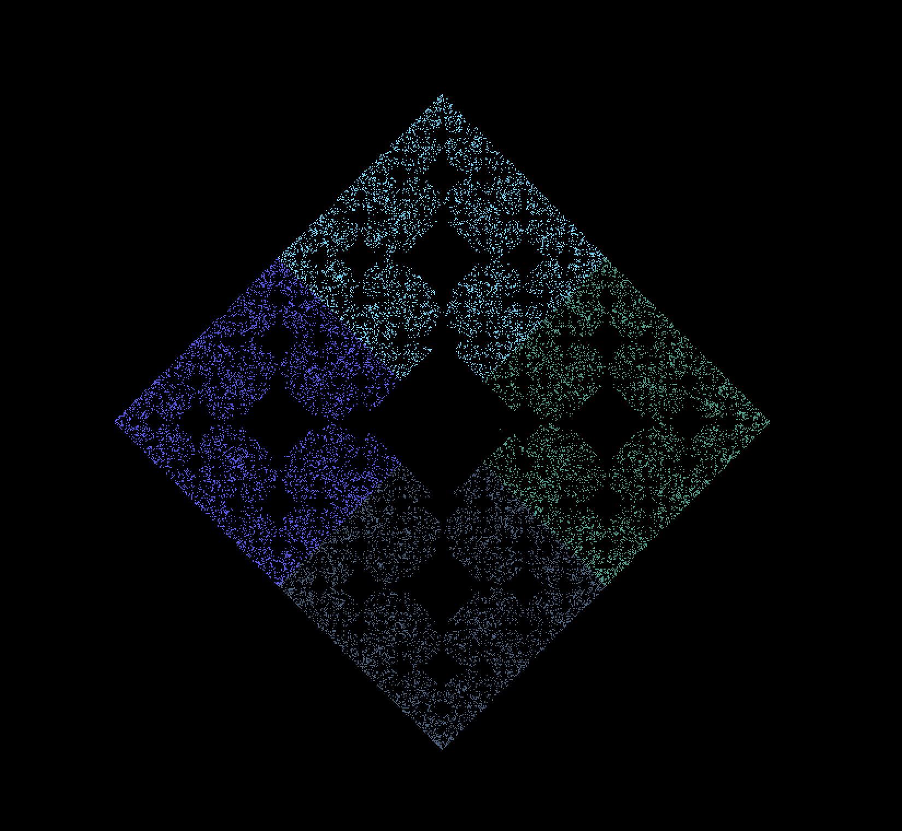
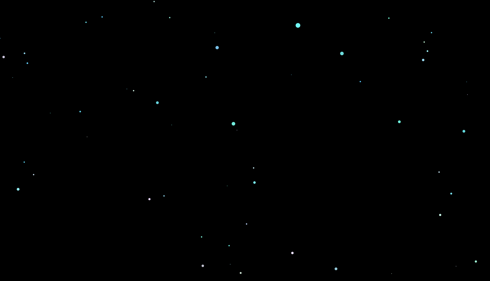
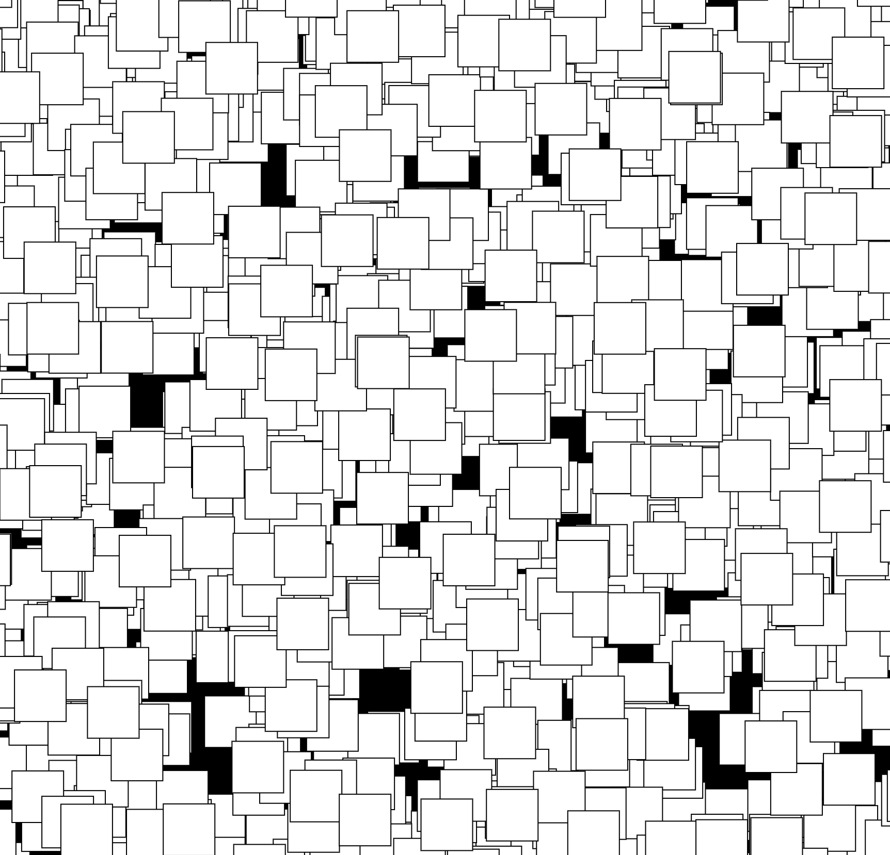
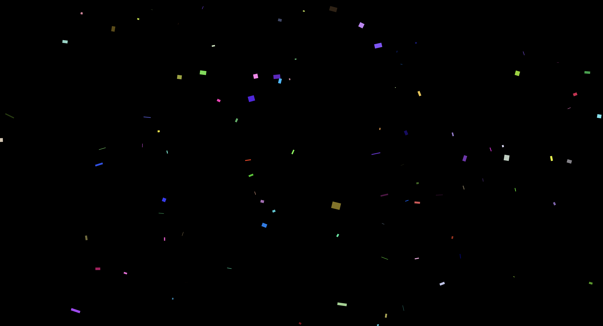
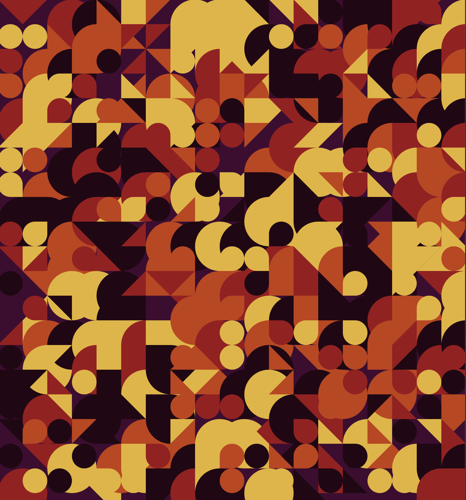
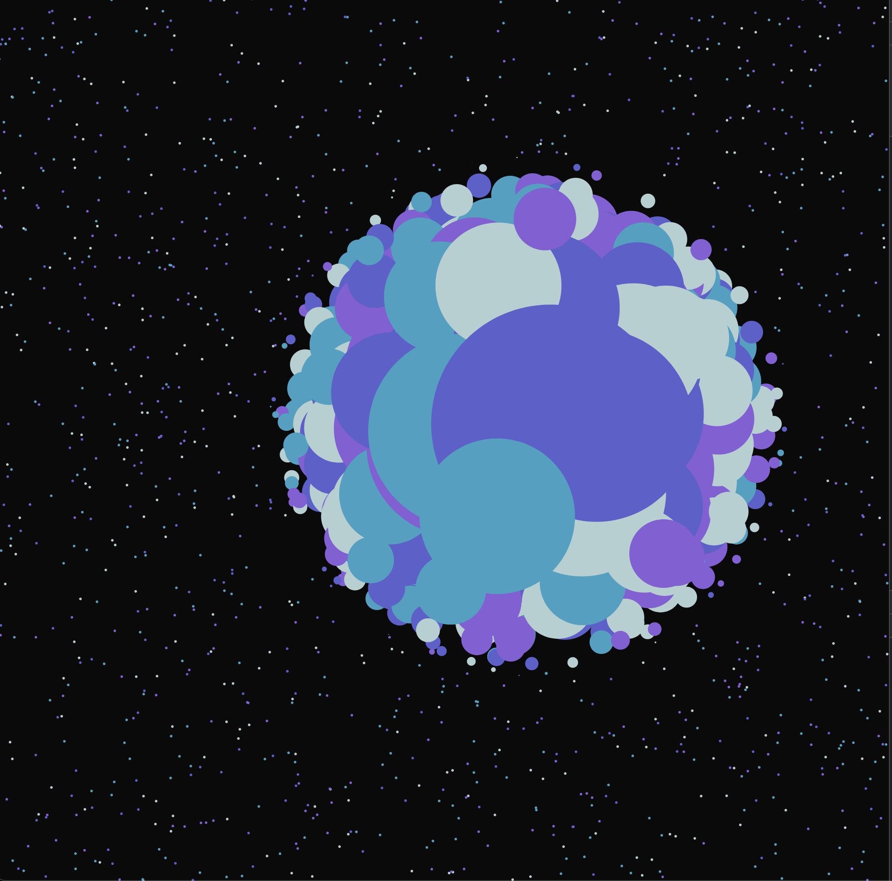
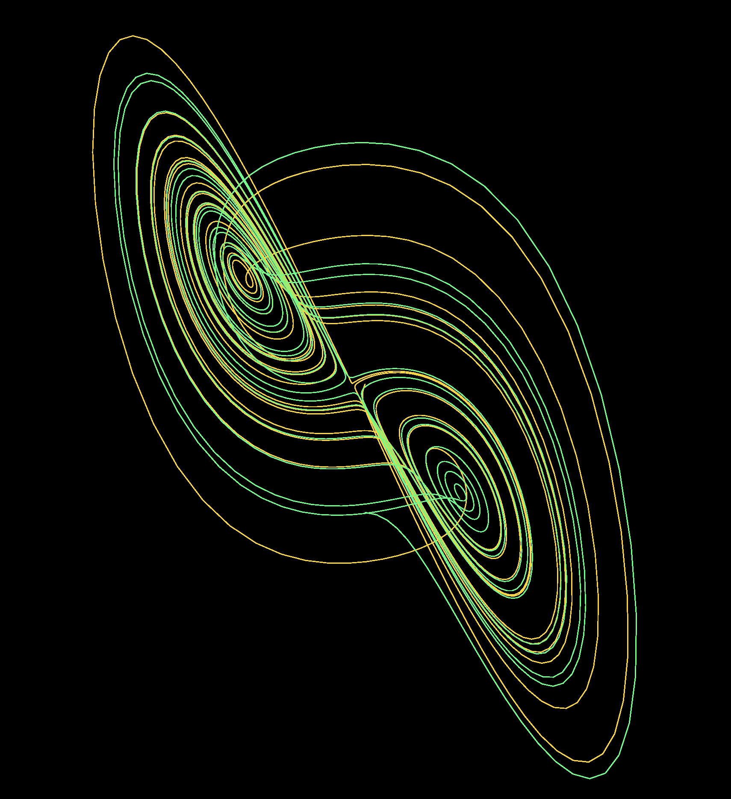

This is a collection of cool ideas I have made with javascript (mostly p5js)

view deployment here https://cosmoglint.github.io/art_with_javascript/

index:

1. [chaos-game](1_chaos_game)
2. [galaxy](2_galaxy)
3. [pulsing circles(smooth)](3_pulsing_circles_with_sine)
4. [square filler](4_square_filler)
5. [confetti](5_confetti)
6. [shaper](6_geometric_art)
7. [bubble magnifier](7_bubble_zoom)
8. [Lorenz attractor](8_lorenz_attractor)

 

1. [chaos-game](1_chaos_game)

2. [galaxy](2_galaxy)

3. [pulsing circles(smooth)](3_pulsing_circles_with_sine)

4. [square filler](4_square_filler)

5. [confetti](5_confetti)

6. [shaper](6_geometric_art)

7. [bubble magnifier](7_bubble_zoom)

8. [Lorenz attractor](8_lorenz_attractor)

