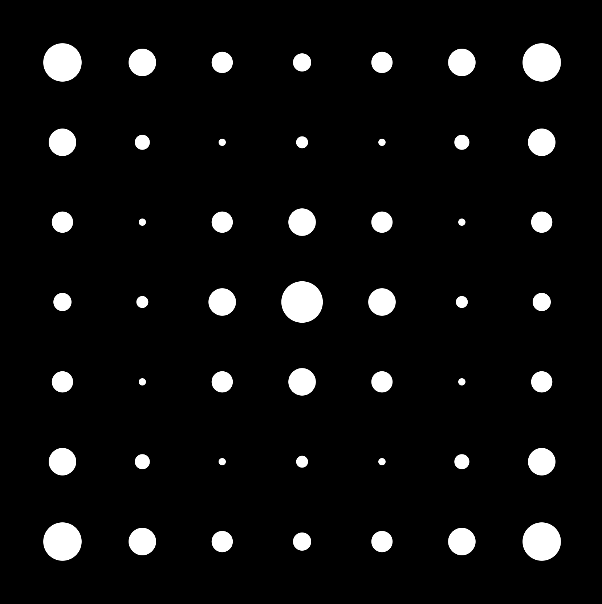

This is a collection of cool ideas I have made with javascript (mostly p5js)

view deployment here https://cosmoglint.github.io/art_with_javascript/

index:

1. [chaos-game](1_chaos_game)
2. [galaxy](2_galaxy)
3. [pulsing circles](3_1_pulsing_circles)
4. [pulsing circles(smooth)](3_pulsing_circles_with_sine)
5. [square filler](4_square_filler)
6. [confetti](5_confetti)

<ul>
  <li></li>
  <li></li>
  <li></li>
  <li></li>
  <li></li>
  <li></li>
</ul>
